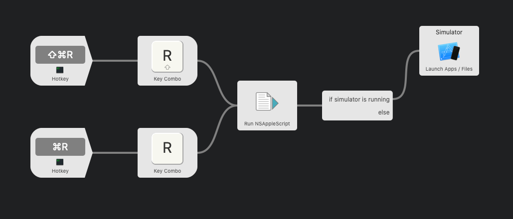

# Flutter Show Simulator On Reload

# Using

As can be seen in the screenshot above, the workflow requires you to use the command-key in combination with r (reload) or shift-r (full reload). The Simulator is only brought to the front when it is already active. This prevents the Simulator from being opened when you are developing with a real device and use this key-combination.
